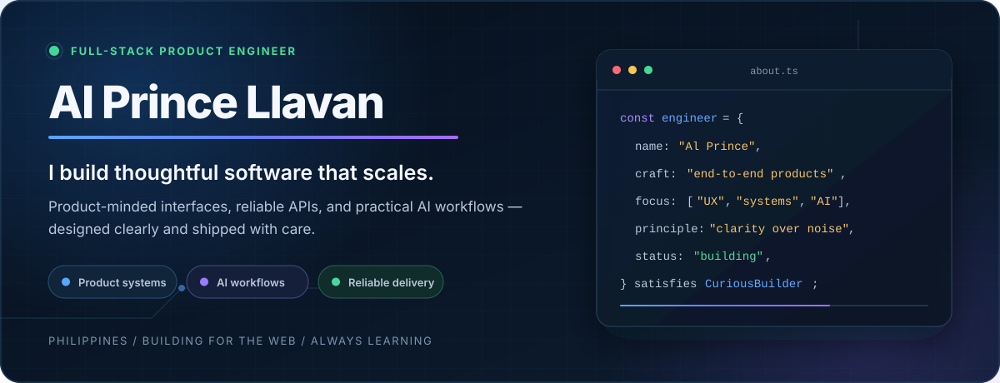

 

## I build products that hold up.

I'm a software engineer from the Philippines who enjoys turning ambitious ideas into clear, dependable products — from polished interfaces to multi-tenant APIs and AI-assisted workflows.

My sweet spot is where **product thinking**, **system design**, and **hands-on engineering** meet. I care about the details users feel, the architecture teams depend on, and the delivery habits that keep software moving.

> **Currently exploring:** operational platforms, real-time collaboration, and practical AI features that remove busywork instead of creating more of it.

## Selected builds

| Product | The problem it tackles | Stack / links |
| :--- | :--- | :--- |
| **SWISH** | A basketball league operations platform designed to bring teams, schedules, competition, and administration into one connected system. | TypeScript · [App](https://github.com/princeprog/swish-app) · [API](https://github.com/princeprog/swish-api-v2) |
| **Synapse** | A real-time AI workspace combining team chat, collaborative docs, RAG-powered Q&A, summaries, task extraction, and workflow automation. | Next.js · NestJS · [UI](https://github.com/princeprog/synapse-ui) · [API](https://github.com/princeprog/synapse-api) |
| **StartupSphere v2** | A startup discovery experience that makes an ecosystem easier to navigate, understand, and visualize. | React · Java · [Frontend](https://github.com/princeprog/startupspherev2-frontend) · [Backend](https://github.com/princeprog/startupspherev2-backend) |
| **Lamika Moalboal** | A modern, customer-focused web presence for a Filipino café in one of Cebu's busiest tourism districts. | Next.js · [Repository](https://github.com/princeprog/lamika-moalboal) |

## How I engineer

| 01 — Product sense | 02 — Systems thinking | 03 — Delivery discipline |
| :--- | :--- | :--- |
| Start with the user and the outcome. Make complexity feel simple. | Design clear boundaries, reliable data flows, and systems that can evolve. | Ship in useful slices, test the risky parts, learn quickly, and improve continuously. |

## Working set

  

 

  
  

---

### Good software starts with a good conversation.

If you're building something useful, ambitious, or delightfully difficult, I'd be glad to hear about it.

[**Visit my portfolio**](https://alprincedev-portfolio.vercel.app) · [**Connect on LinkedIn**](https://www.linkedin.com/in/alprince-llavan-34952728a/) · [**Email me**](mailto:alprincellavan2019@gmail.com)

